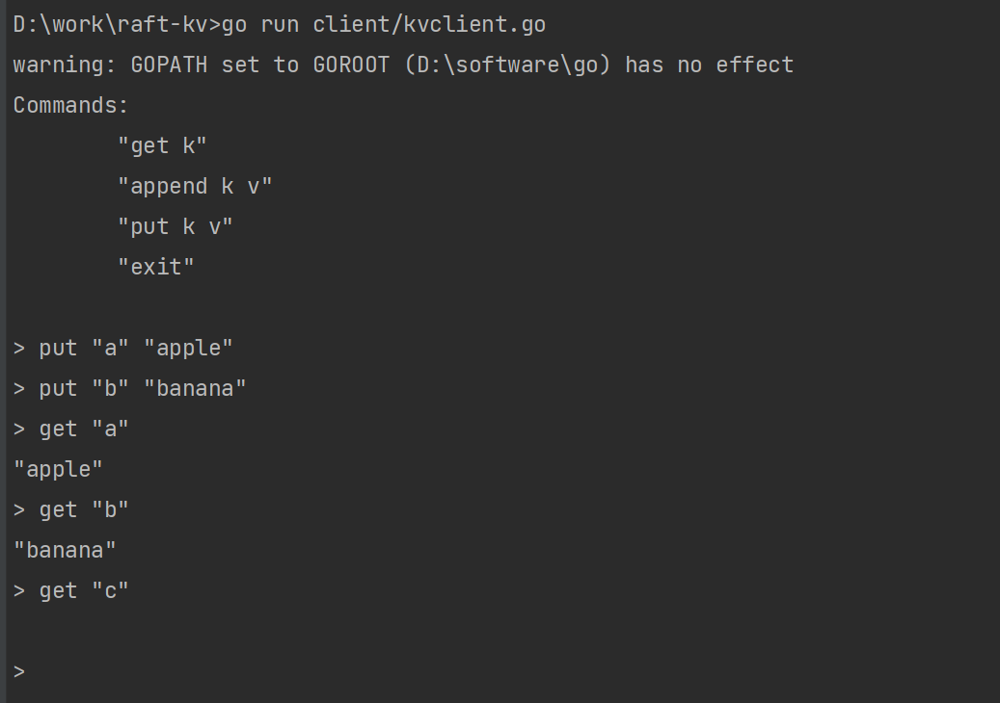

# 介绍

本项目实现了一个基于Raft算法的KV数据库，参考资料是MIT6.824分布式系统的课程，我在看了MIT6.824关于Raft算法的几个章节以及Raft算法的论文之后实现的一个项目。

Raft论文：[In Search of an Understandable Consensus Algorithm(Extended Version)](https://raft.github.io/raft.pdf)

部分代码参考了一些别的实现。

其中主要的难点就是对Raft算法的理解，以及实现中的一些细节，对我来说最难的就是并发的一些东西。就是**设计好哪些地方该加锁，哪些地方不该加锁，即如何在保证并发数据正确的情况下，保证并发的性能**。

## 主要模块

项目代码主要分为几个模块：

- rpcutil: 用于实现RPC通信的一些接口, 封装了go的net库提供的RPC通信框架。
- raft: Raft协议实现的主体部分, 主要实现了Raft协议中的leader选举和日志复制功能。
- kvdb: 基于raft协议实现的一个kv数据库，用到了raft模块的东西。

下面详细介绍这几个模块：

- rpcutil模块

rpcutil包含一个rpc.go文件，封装了RPC通信的一些接口，主要是一个结构体：
```go
type ClientEnd struct {
Addr   string
// 与对端通信的rpc工具
Client *rpc.Client
}
```
为上述结构体实现了*Call*方法和*TryConnect*方法：
```go
// 调用这个函数来进行RPC通信
func (e *ClientEnd) Call(methodName string, args interface{}, reply interface{}) bool
// 获取一个Client通信实例
func TryConnect(address string) *rpc.Client
```
在Raft实现的时候，会用到这个文件里的一些接口。

- raft模块

raft协议实现的主体部分, 每个Raft节点维护的数据结构如下：
```go
type Raft struct {
	mu        sync.Mutex           // 互斥锁，用于共享变量的同步
	peers     []*rpcutil.ClientEnd // 服务器列表, 用来进行RPC通信的(ClientEnd实现参见package rpcutil)
	persister *Persister           // 持久化对象
	me        int                  // 当前服务器在服务器列表peers中的索引
	dead      int32                // 当前服务器是否宕机

	// 一个Raft节点必须要维护的一些数据结构
	currentTerm int        // 服务器最后一次知道的任期号（初始化为 0，持续递增）
	votedFor    int        // 在当前获得选票的候选人的 Id
	logs        []LogEntry // 日志条目集；每一个条目包含一个用户状态机执行的指令，和收到时的任期号

	// lastApplied的ID不能大于commitIndex的ID，因为只有commited状态的日志才能被提交到状态机执行
	commitIndex int // 已知的最大的已经被提交的日志条目的索引值
	lastApplied int // 最后被应用到状态机的日志条目索引值（初始化为 0，持续递增）

	nextIndex  []int // 对于每一个服务器，需要发送给他的下一个日志条目的索引值（初始化为领导人最后索引值加一）
	matchIndex []int // 对于每一个服务器，已经复制给他的日志的最高索引值（初始化为0）

	identity     int	// 当前服务器的身份(follower, candidate, or leader)
	peersLen     int	// 服务器的总数
	hbCnt        int
	applyCh      chan ApplyMsg	// 用于提交命令的管道
	doAppendCh   chan int	// 用于AppendEntries的管道(用于heartbeat或者是appendEntries)
	applyCmdLogs map[interface{}]*CommandState	// 用于保存命令的字典
}
```
代码里的函数和其对应的主要作用如下：
```go
// 返回当前服务器状态（当前任期号以及当前服务器是否是leader）
func (rf *Raft) GetState() (int, bool)

// 将raft的状态进行持久化
// 需要持久化的数据有votedFor, currentTerm, 以及对应的日志logs
func (rf *Raft) persist()

// 从之前保存的持久化状态恢复
func (rf *Raft) readPersist(data []byte)

// RequestVote函数，用于candidate请求其他服务器进行投票, 如果超过半数为其投票, 则当前candidate变为leader
// 投票选取leader的条件是：leader的Term是最大的，同时日志的Index也是最大的
func (rf *Raft) RequestVote(args *RequestVoteArgs, reply *RequestVoteReply) error

// AppendEntries函数，有两个功能，HeartBeat和log replication功能
func (rf *Raft) AppendEntries(args *AppendEntriesArgs, reply *AppendEntriesReply) error

// RequestVote的RPC接口, 请求ID为server的投票
func (rf *Raft) sendRequestVote(server int, args *RequestVoteArgs, reply *RequestVoteReply) bool

// AppendEntries的RPC接口, 请求ID为server的日志复制和HeartBeat
func (rf *Raft) sendAppendEntries(server int, args *AppendEntriesArgs, reply *AppendEntriesReply) bool

// Raft节点执行命令, 调用此接口来是Raft节点执行对应的命令
func (rf *Raft) Start(command interface{}) (int, int, bool)

// 向所有follower发送日志
func (rf *Raft) sendLogEntry(flag int)

// 将commited状态的命令提交到状态机执行
func (rf *Raft) apply()

// 返回一个Raft节点实例
/*
    参数：
   	peers: 		表示集群中的所有服务器
   	me:			表示当前服务器在peers中的索引
   	persister:	一个持久化对象
   	applyCh:	Apply通道, 将需要状态机Apply的命令传入到applyCh通道中, 数据库从applyCh通道中取命令行
    返回:
   	一个Raft实例
*/
func MakeRaft(peers []*rpcutil.ClientEnd, me int, persister *Persister, applyCh chan ApplyMsg) *Raft

// leader选举函数
func (rf *Raft) leaderElection(wonCh chan int, wgp *sync.WaitGroup)
```
具体的函数调用关系如下：
```go
MakeRaft函数生成一个Raft节点实例，同时里面开启两个协程不断循环进行leader选举(即调用leaderElection)以及日志复制(即调用sendLogEntry)
sendLogEntry(将日志复制到所有follower) -> sendAppendEntries -> Call(AppendEntries)(进行RPC通信)
leaderElection -> sendRequestVote -> Call(RequestVote)(进行RPC通信来做leader选举)
```

- kvdb模块

kvdb模块主要基于raft模块实现了一个分布式的kv数据库。
Server的主要结构体如下：
```go
type KVServer struct {
	mu      sync.Mutex
	me      int	// 当前节点的索引号
	rf      *raft.Raft	// 当前节点对应的Raft实例
	applyCh chan raft.ApplyMsg	// Apply通道，用来执行命令
	dead    int32

	maxraftstate int // 如果日志变得很长，就备份一份快照

	data          map[string]string	// 存储的数据
	commonReplies []*CommonReply	// 命令执行的返回值
}
```
每一个服务器包含一个Raft节点。

KVServer模块主要提供了用来进行RPC通信的接口，Get和PutAppend，用来查询和添加数据, 以及一个执行Apply命令的函数：
```go
// Get接口, 供Client进行RPC调用
func (kv *KVServer) Get(args *GetArgs, reply *GetReply) error

// PutAppend接口, 供client进行RPC通信
func (kv *KVServer) PutAppend(args *PutAppendArgs, reply *PutAppendReply) error

// 查找数据库执行的返回值，看是否成功执行
func (kv *KVServer) findReply(op *Op, idx int, reply *CommonReply) string

// server的入口函数, 此处创建一个KVServer实例，然后启动一个协程来做Apply到数据库的一些操作
func StartKVServer(servers []*rpcutil.ClientEnd, me int, persister *raft.Persister, maxraftstate int) *KVServer

// 这个函数不断循环从applyCh通道中读取Apply到数据库的命令，并执行具体的命令
func (kv *KVServer) opHandler()
```

函数调用关系如下：
```go
Get和PutAppend函数是供客户端进行RPC远程调用的
Get and PutAppend -> findReply
StartKVServer -> opHandler
```

Client的主要结构如下：
```go
// 客户端维护的一些数据
type Clerk struct {
	//
	servers []*rpcutil.ClientEnd
	id      uuid.UUID
	servlen int
	leader  int
}
```
*client.go*主要实现了以下函数：
```go
// 获取具体的客户端实例
func MakeClerk(servers []*rpcutil.ClientEnd) *Clerk

// 客户端Get函数
func (ck *Clerk) Get(key string) string

// 客户端Put或者Append操作
func (ck *Clerk) putAppend(key string, value string, op string)

// 获取客户端通信实例
func GetClientEnds(path string) []*rpcutil.ClientEnd
```

## 具体用法

- 启动server

下面启动包含三个节点的Raft集群，配置文件见，example/config/server1.yml，可根据自己需求更改。
```shell
cd .../raft-kv
go run server/kvserver.go example/config/server1.yml
go run server/kvserver.go example/config/server2.yml
go run server/kvserver.go example/config/server3.yml
```

- 启动client

```shell
go run client/kvclient.go
```

Client端运行如下：
